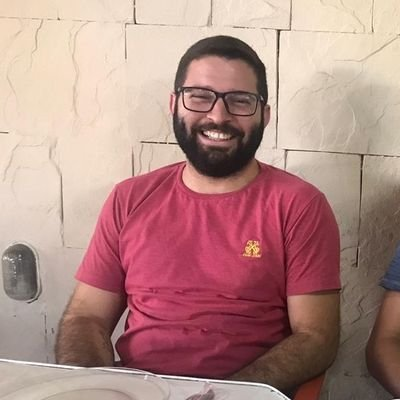

## Sobre

Fala galera! meu nome é Jakson Rodrigues e criei esse blog para compartilhar um pouco do meu conhecimento com a comunidade. A ideia é trazer dicas rápidas e artigos sobre diversos assuntos na área de Infraestrutura como Código, Computação em Nuvem, Linux, Kubernetes e um pouco sobre desenvolvimento em pt-BR para ajudar as pessoas que não tiveram oportunidade de aprender inglês e tem um pouco de dificuldade em achar conteúdo em português.

Sou formado em Redes de Computadores pelo Centro Universitário de João Pessoa (Unipê) e estou cursando Especialização em Desenvolvimento de Sistemas para Web tambêm no Unipê. 

Comecei a trabalhar na área de informática em 2013 com manutenção de computadores e em seguida gerenciamento de servidores Linux e Windows. Me apaixonei pela área de infraestrutura e em 2015 entrei no curso de Redes de Computadores. Mas também sou apaixonado pela área de desenvolvimento e programo como hobby desde os meus 14 anos, por isso me dei tão bem nessa área de DevOps pois posso juntar os dois mundos e assim aprender cada vez mais.

Atualmente trabalho como DevOps Engineer (O novo cargo do momento hehehe!) e gerencio junto com minha equipe mais de dez clusters Kubernetes na Azure usando AKS, e tudo isso sendo provisionado e gerenciado via código com o Terraform.

